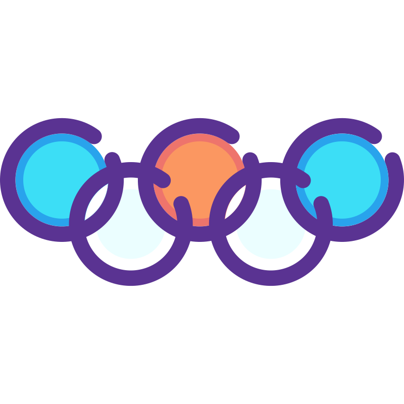
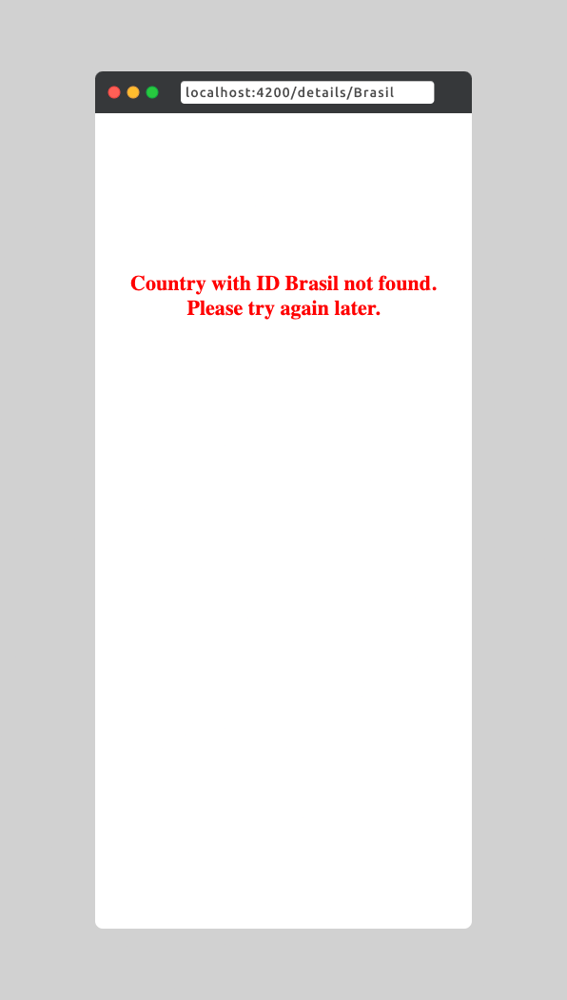

<div align="center" id="top"> 
  
</div>

<h1 align="center">Olympic Games</h1>

<p align="center">
  
  
  
</p>

<p align="center">
  <a href="#features">Features</a> &#xa0; | &#xa0;
  <a href="#screenshots">Screenshots</a> &#xa0; | &#xa0;
  <a href="#features">Features</a> &#xa0; | &#xa0;
  <a href="#screenshots">Screenshots</a> &#xa0; | &#xa0;
  <a href="#technologies">Tecgnologies</a> &#xa0; | &#xa0;
  <a href="#requirements">Requirements</a> &#xa0; | &#xa0;
  <a href="#getting-started">Getting started</a> &#xa0; | &#xa0;
  <a href="#usage">Usage</a> &#xa0; | &#xa0;
  <a href="https://github.com/NDRBAX" target="_blank">Author</a>
</p>

<br>

This project is an Angular-based application designed to visualize and navigate Olympic data through a dashboard and detailed views. The app implements a responsive and user-friendly interface with dynamic data handling, ensuring a seamless experience across all devices.

## Features

- **Data Visualization :** Dynamic charts displaying Olympic statistics.
- **Routing :** Smooth navigation between a dashboard and detailed data pages.
- **Responsive Design :** Optimized layouts for desktop, tablet, and mobile.
- **Error Handling :** Informative error messages and fallback options for various scenarios.
- **Robust Type Management:** Strongly typed models and interfaces using TypeScript.

## Screenshots

### 🖥️ Large screens

</br>

<div align="center">


</div>

### 📱 Smartphone

</br>

<div align="center">




</div>

</br>

## Technologies

- **Framework :** Angular
- **Data Management :** TypeScript interfaces and HTTP services
- **Charting Library :** Using ngx-charts for data visualization
- **Styling :** SCSS for responsiveness and custom styling

## Requirements

- **Node.js :** >= 2O.x
- **Angular CLI :** >= 18.x
- **Git :** Installed on your machine

## Getting Started

1. Clone the repository.
   ```bash
   git clone https://github.com/NDRBAX/Olympic-Games.git
   ```
2. Install dependencies.
   ```bash
   cd Olympic-Games
   npm install
   ```
   Or if you're using Yarn:
   ```bash
   yarn install
   ```
3. Run the development server.
   ```bash
   ng serve
   ```
4. Open the app in your browser. Navigate to `http://localhost:4200/`. The application will automatically reload if you change any of the source files.
   ```bash
    http://localhost:4200/
   ```

## Usage

To test error handling, you can try the following scenarios:

1. **Data Fetch Error :** Change the API URL in the service to an invalid endpoint in `src/app/core/services/olympic.service.spec.ts` :

   ```typescript
   // private readonly olympicUrl = './assets/mock/olympic.json';
   private readonly olympicUrl = 'invalid-url';
   ```

2. URL Error : Try to navigate to a non-existent country detail page such as `http://localhost:4200/details/Canada`.
